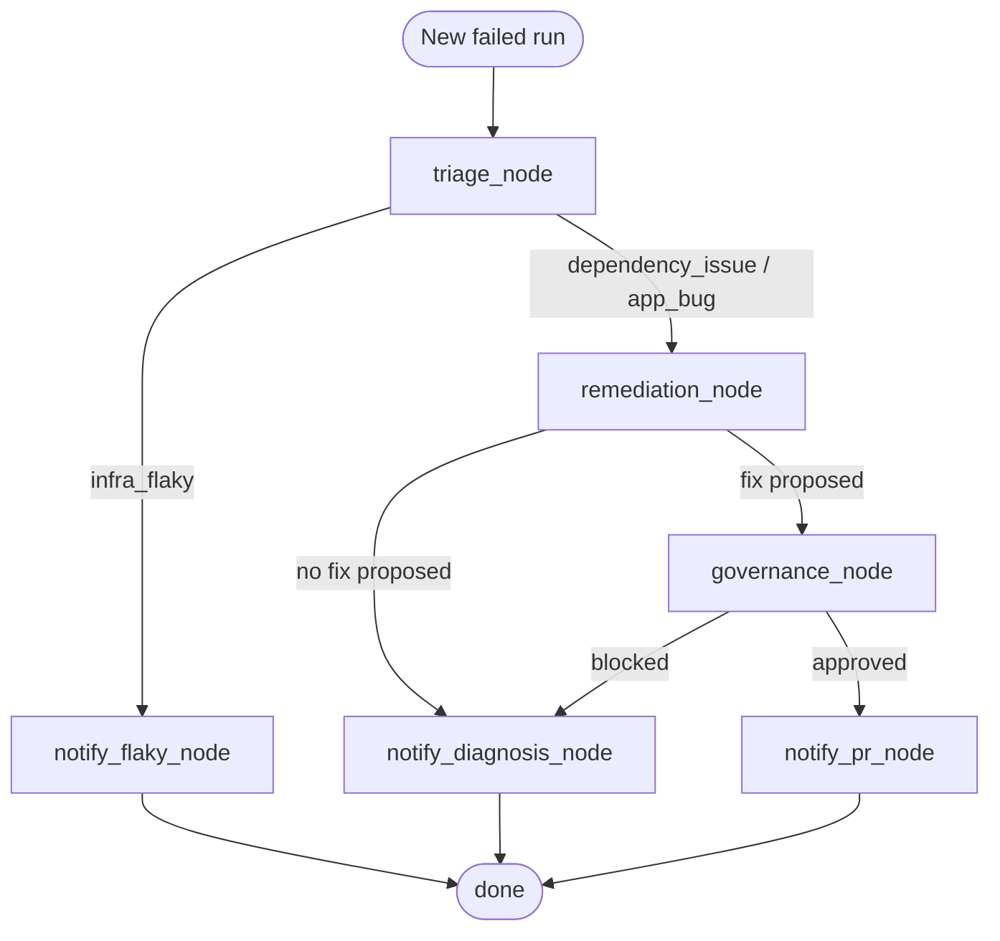
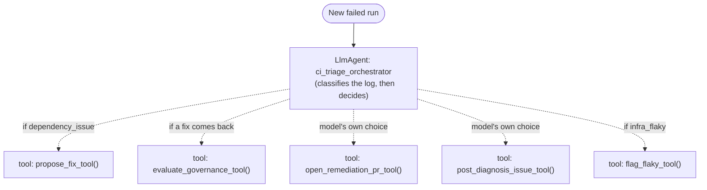

# Self-Healing CI Agent

A standalone, multi-agent system that watches other repos' CI pipelines for
real failures, diagnoses root cause with an LLM, and either fixes the safe
categories automatically (with a real governance gate) or hands a developer
a ready-made diagnosis for anything that requires understanding business
intent. It never guesses at application logic — that boundary is enforced
by design, not just by prompt.

This repo is the "brain"; the repos it watches (e.g. `SampleApp`) are the
"bodies." It never runs inside their pipelines — it polls them from the
outside via the GitHub API, on its own schedule.

## Architecture

```
Orchestrator (scheduled, every 15 min)
  └─ for each watched repo, for each new failed run:
       Triage Agent        -> classify root cause + confidence (Groq LLM)
       ├─ infra_flaky?     -> Notifier: flag as flaky, no code change
       └─ else:
            Remediation Agent -> propose a fix (dependency_issue only,
                                  never for app_bug)
            ├─ no fix proposed -> Notifier: diagnosis Issue
            └─ fix proposed:
                 Governance Agent -> approve/block against policy.yml
                 ├─ approved -> Notifier: open PR with the fix
                 └─ blocked  -> Notifier: diagnosis Issue
       Every decision, either way, is appended to audit/log.jsonl
```

| Agent | File | Job |
|---|---|---|
| Orchestrator | `agents/orchestrator.py` | Finds new failures, drives each through the pipeline |
| Triage | `agents/triage_agent.py` | Classifies: `infra_flaky` / `dependency_issue` / `app_bug`, with confidence |
| Remediation | `agents/remediation_agent.py` | Proposes a fix — only a confident, mechanical revert of a dependency-manifest file changed in the last commit; never generates code |
| Governance | `agents/governance_agent.py` | Approves/blocks a proposed fix against `config/policy.yml`; always logs why |
| Notifier | `agents/notifier_agent.py` | The only agent that talks to a watched repo — opens the PR, flags flaky, or posts a diagnosis Issue tagging the likely developer |

## Why application bugs are never auto-fixed

`dependency_issue` failures have an objectively correct fix: the dependency
manifest changed, the build broke, revert the manifest change. `app_bug`
failures don't — "the test expected 5 and got 6" doesn't tell you whether
the test or the code is wrong, only a human who knows the intended behavior
does. So `app_bug` never reaches the Remediation Agent with anything to
propose; it always goes straight to a diagnosis Issue instead.

## Governance

`config/policy.yml` is the single source of truth for what the Governance
Agent will allow:

- `enabled` — global kill switch.
- `repos.<owner>/<repo>.enabled` — per-repo kill switch (default deny — a
  repo not listed here is never auto-fixed).
- `auto_fix_categories` — allowlist of Triage categories eligible for
  auto-fix.
- `min_confidence` — Triage confidence floor; below it, always fall back to
  a diagnosis Issue regardless of category.
- `max_files_changed` — blast-radius limit on a proposed fix.

Every Governance check — approved or blocked — is written to
`audit/log.jsonl` with its reasoning, alongside every Triage classification
and Notifier action. That file is the full audit trail: what the agent saw,
what it decided, and why, for every run it ever processed.

## LLM provider

The Triage Agent calls whatever's configured in `config/llm.yml` — `lib/llm_client.py`
has no provider-specific code, it just speaks the OpenAI-compatible
chat-completions format that Groq, GitHub Models, OpenAI, and most other
providers all support. Switching providers or models is a one-line config
edit, not a code change:

```yaml
provider: groq
base_url: https://api.groq.com/openai/v1/chat/completions
model: llama-3.3-70b-versatile
api_key_env: GROQ_API_KEY
```

`api_key_env` names the environment variable the client reads the API key
from. `.github/workflows/watch.yml` already exposes `GROQ_API_KEY`,
`GITHUB_MODELS_TOKEN`, and `OPENAI_API_KEY` (each from a same-named repo
secret) — commented-out examples for both are in `config/llm.yml`, so
switching between those three is just uncommenting one block. Only a
provider not already listed there needs a new line added to the workflow's
`env:` block plus a matching secret.

## Setup

1. **Watched repos**: list them in `config/watched_repos.yml`.
2. **LLM API key**: `gh secret set GROQ_API_KEY` on this repo (free tier at
   [console.groq.com](https://console.groq.com)) — or whichever secret name
   matches `api_key_env` in `config/llm.yml` if you've switched providers.
3. **Watched-repo access**: create a fine-grained GitHub PAT scoped to
   exactly the repos in `watched_repos.yml`, with:
   - Contents: Read and write
   - Pull requests: Read and write
   - Issues: Read and write
   - Actions: Read-only

   Then `gh secret set WATCHED_REPOS_PAT` on this repo. This repo's own
   `GITHUB_TOKEN` is never used against watched repos — only to commit
   `state/` and `audit/` back to itself.

## Running it

It runs on its own every 15 minutes via `.github/workflows/watch.yml`. To
run it on demand: `gh workflow run watch.yml`.

To generate a real failure to watch for, trigger `SampleApp`'s own demo
scenario (see its README) — that produces a genuine failed run in a real
repo for this agent to discover and react to on its next poll.

## Backlog (deliberately deferred)

- **Triage eval set**: a small labeled set of sample failure logs with
  known-correct categories, to measure the Triage Agent's classification
  accuracy before trusting it further — not built yet.
- **Cross-run failure memory**: `state/` currently only dedupes
  already-processed runs. It doesn't yet track patterns over time (e.g. "this
  test has failed 5 times this month"), which would need a real persistence
  decision beyond a per-repo last-run-id file.

## Same architecture, different toolkits (LangGraph & ADK)

This repo deliberately uses no agent framework — every piece of control
flow in `orchestrator.py` is a plain `if`/`return`, so nothing about how
this actually works is hidden behind an abstraction. For comparison, here's
how the exact same design would map onto **LangGraph** and onto Google's
**ADK**, reusing the real function names from this codebase. These are
illustrative sketches to show the shape of each mapping, not tested code.

### If this were LangGraph

LangGraph's explicit nodes and conditional edges map almost one-to-one onto
`process_failure()`'s existing branches — porting this would mostly mean
turning that function's `if`/`return` chain into graph wiring, not
rewriting any of the underlying logic.



```python
from typing import TypedDict, Optional
from langgraph.graph import StateGraph, END

class CIState(TypedDict):
    repo: str
    run: dict
    triage_result: Optional[dict]
    proposed_fix: Optional[dict]
    governance_result: Optional[dict]
    notification: Optional[dict]

def triage_node(state: CIState) -> CIState:
    log_text = client.get_run_log_text(state["repo"], state["run"]["id"])
    return {**state, "triage_result": triage_agent.classify(log_text)}

def remediation_node(state: CIState) -> CIState:
    fix = remediation_agent.propose_fix(client, state["repo"], state["run"], state["triage_result"])
    return {**state, "proposed_fix": fix}

def governance_node(state: CIState) -> CIState:
    result = governance_agent.evaluate(policy, state["repo"], state["triage_result"], state["proposed_fix"])
    return {**state, "governance_result": result}

def route_after_triage(state: CIState) -> str:
    return "notify_flaky" if state["triage_result"]["category"] == "infra_flaky" else "remediation"

def route_after_remediation(state: CIState) -> str:
    return "governance" if state["proposed_fix"] else "notify_diagnosis"

def route_after_governance(state: CIState) -> str:
    return "notify_pr" if state["governance_result"]["approved"] else "notify_diagnosis"

graph = StateGraph(CIState)
graph.add_node("triage", triage_node)
graph.add_node("remediation", remediation_node)
graph.add_node("governance", governance_node)
graph.add_node("notify_flaky", lambda s: {**s, "notification": notifier_agent.flag_flaky(client, s["repo"], s["run"], s["triage_result"])})
graph.add_node("notify_diagnosis", lambda s: {**s, "notification": notifier_agent.post_diagnosis_issue(client, s["repo"], s["run"], s["triage_result"], s.get("governance_result"))})
graph.add_node("notify_pr", lambda s: {**s, "notification": notifier_agent.open_remediation_pr(client, s["repo"], s["run"], s["triage_result"], s["proposed_fix"], s["governance_result"])})

graph.set_entry_point("triage")
graph.add_conditional_edges("triage", route_after_triage, {"notify_flaky": "notify_flaky", "remediation": "remediation"})
graph.add_conditional_edges("remediation", route_after_remediation, {"governance": "governance", "notify_diagnosis": "notify_diagnosis"})
graph.add_conditional_edges("governance", route_after_governance, {"notify_pr": "notify_pr", "notify_diagnosis": "notify_diagnosis"})
for end_node in ("notify_flaky", "notify_diagnosis", "notify_pr"):
    graph.add_edge(end_node, END)

app = graph.compile()
```

Note what stays identical: `triage_agent.classify`, `remediation_agent.propose_fix`,
`governance_agent.evaluate`, and every `notifier_agent` function are called
completely unchanged. LangGraph only replaces the *wiring* around them.

### If this were ADK

ADK's idiomatic shape for this kind of branchy, tool-using job is a single
`LlmAgent` holding all four downstream actions as tools, with the model's
own reasoning — driven by its instructions — deciding which to call and
when, rather than code-defined edges deciding for it.



*(Dashed arrows above are deliberate — see the trade-off note below.)*

```python
from google.adk.agents import LlmAgent
from google.adk.runners import Runner
from google.adk.sessions import InMemorySessionService

def propose_fix_tool(triage_category: str, repo: str, run_id: int) -> dict:
    """Wraps remediation_agent.propose_fix. Returns a fix, or an empty
    result if none can be confidently proposed."""
    ...

def evaluate_governance_tool(repo: str, category: str, confidence: float, files_changed: int) -> dict:
    """Wraps governance_agent.evaluate against policy.yml."""
    ...

def open_remediation_pr_tool(...) -> dict: ...   # wraps notifier_agent.open_remediation_pr
def post_diagnosis_issue_tool(...) -> dict: ...  # wraps notifier_agent.post_diagnosis_issue
def flag_flaky_tool(...) -> dict: ...            # wraps notifier_agent.flag_flaky

ci_triage_orchestrator = LlmAgent(
    name="ci_triage_orchestrator",
    model="gemini-2.0-flash",
    instructions="""Classify the CI failure from the log tail as infra_flaky,
    dependency_issue, or app_bug. If infra_flaky, call flag_flaky_tool.
    Otherwise call propose_fix_tool. If it returns no fix, call
    post_diagnosis_issue_tool. If a fix comes back, call
    evaluate_governance_tool; if approved, call open_remediation_pr_tool —
    otherwise call post_diagnosis_issue_tool.""",
    tools=[propose_fix_tool, evaluate_governance_tool,
           open_remediation_pr_tool, post_diagnosis_issue_tool, flag_flaky_tool],
)

session_service = InMemorySessionService()
runner = Runner(agent=ci_triage_orchestrator, app_name="ci_healer", session_service=session_service)
```

### The trade-off this comparison actually reveals

In both the real hand-rolled version and the LangGraph sketch,
`governance_agent.evaluate()` runs **unconditionally in code** — there is no
path through `process_failure()`, or through the LangGraph graph's edges,
that reaches `open_remediation_pr` without governance approving first. It's
enforced the same way a wall enforces itself: nothing gets past it because
nothing else runs.

In the ADK sketch, that guarantee moves into the *instructions* — the model
is told to always call the governance tool before opening a PR, but nothing
in the code forces it to. A confused or adversarially-prompted model could,
in principle, call `open_remediation_pr_tool` directly. That's a concrete,
real-stakes version of the guardrails point from `agentic-patterns-explained`:
**an instruction is not a boundary.** If this were actually rebuilt in ADK,
the fix would be to keep governance as deterministic code the tool itself
runs before doing anything irreversible — not something the model has to
remember to call — rather than trusting the prompt alone.
